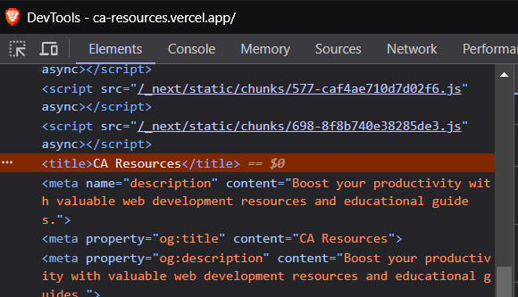
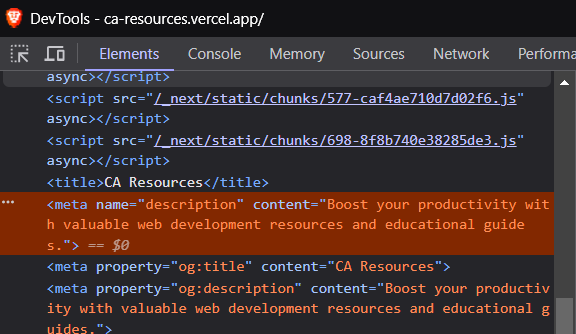

# Contribution Guide for Adding Resources

## Table of Contents

- [Contribution Guide for Adding Resources](#contribution-guide-for-adding-resources)
  - [Table of Contents](#table-of-contents)
  - [Fork](#fork)
    - [1. Fork the Repository](#1-fork-the-repository)
    - [2. Clone Your Fork](#2-clone-your-fork)
    - [3. Create a New Branch](#3-create-a-new-branch)
  - [File Path Where the Resources are Stored](#file-path-where-the-resources-are-stored)
  - [Steps to Gather Resource Information](#steps-to-gather-resource-information)
    - [1. Use Desktop/Laptop](#1-use-desktoplaptop)
    - [2. Gather Title](#2-gather-title)
    - [3. Get the URL](#3-get-the-url)
    - [4. Get the Description](#4-get-the-description)
    - [5. Find the Icon](#5-find-the-icon)
      - [Example Submission](#example-submission)
  - [Improving Existing Resources](#improving-existing-resources)
    - [Update Existing Entries](#update-existing-entries)
    - [Provide Feedback](#provide-feedback)
  - [Submitting Your Contribution](#submitting-your-contribution)
    - [1. Commit Your Changes](#1-commit-your-changes)
    - [2. Push to Your Fork](#2-push-to-your-fork)
    - [3. Create a Pull Request](#3-create-a-pull-request)

> [!WARNING]
> This guide assumes you have a GitHub account and are familiar with the basics of Git and GitHub.

## Fork

### 1. Fork the Repository

Begin by visiting the [project repository](https://github.com/bryan308/ca-resources) and clicking the **Fork** button. This action creates a personal copy of the repository under your account, allowing you to make changes without affecting the original project. For more details, refer to the [GitHub Docs on Forking](https://docs.github.com/en/get-started/quickstart/fork-a-repo).

### 2. Clone Your Fork

Next, clone your forked repository to your local machine. This allows you to work on your contributions in your local development environment.

```bash
git clone https://github.com/your-username/ca-resources.git
```

> [!WARNING]
> Make sure to replace `your-username` with your actual GitHub username.

### 3. Create a New Branch

Before making any changes, create a new branch with a descriptive name that reflects the nature of your contribution. This helps keep your work organized and makes it easier for others to review.

```bash
git checkout -b v2/add-resource
```

-----

## File Path Where the Resources are Stored

The resources are stored in the `resources.ts` file located at:

```text
/ca-resources/data/
  └─ resources.ts
```

```typescript
page: { // object key as the resource path
  title: "",
  // ...
  resourcesList: [
    {
      title: "", // Title of the resources category (optional)
      links: [
        {
          title: "", // Title of the specific link
          url: "",
          description: "",
          iconPath: "",
        }
      ]
    }
  ]
}
```

-----

## Steps to Gather Resource Information

### 1. Use Desktop/Laptop

It is recommended to use a desktop or laptop for ease of gathering information by inspecting website elements. Open the website you want to add.

### 2. Gather Title

Using developer tools, inspect the website’s `<title>` element inside the `<head>` tag and copy the text to use as the resource title.



### 3. Get the URL

Copy the main website URL; if the webpage is a subpage, it's okay to use it as long as it directs users to the main webpage.

### 4. Get the Description

Look for the `<meta name="description" content="...">` tag in the `<head>` section. Copy the `content` attribute's value as the description.



If it's not available, you can use AI to describe the website.

### 5. Find the Icon

Use `favicon.ico` if there are no icons available, but try to find a high-resolution icons first. If multiple icons are available, choose one that is similar to the favicon used. Some websites may not have an icon; you can leave it blank. Store icons in the relevant folder inside `/public/resources/`.

```text
/ca-resources/
  └─ public
    └─ resources
      └─ colors
      └─ icons
      └─ inspirations
      └─ learnwebdev
      └─ mockups
      └─ stock-photos
      └─ typography
```

#### Example Submission

```typescript
{
  title: "MDN Web Docs",
  url: "https://developer.mozilla.org/en-US/",
  description: "Provides information about Open Web technologies including HTML, CSS, and APIs.",
  iconPath: "/resources/learnwebdev/mdn.png"
}
```

-----

## Improving Existing Resources

If you notice any outdated or incorrect information in existing resources, or if you have suggestions for improving them, please feel free to make those updates!

### Update Existing Entries  

Edit `resources.ts` to correct or enhance existing resources with better information or improved descriptions.

### Provide Feedback

If you have suggestions for improving resource descriptions or other details, please include them in your pull request comments.

Your contributions help keep our resource list accurate and useful for everyone!

-----

## Submitting Your Contribution

### 1. Commit Your Changes

Stage and commit your changes:

```bash
git add .
git commit -m "add: [website name]"
```

### 2. Push to Your Fork

Push changes to your forked repository:

```bash
git push --set-upstream origin v2/add-resource
git push
```

### 3. Create a Pull Request

Create a pull request on the original repository, providing a description of the resource and its benefits. [GitHub Docs on Pull Requests](https://docs.github.com/en/get-started/quickstart/contributing-to-projects)

Happy Coding! 🚀
